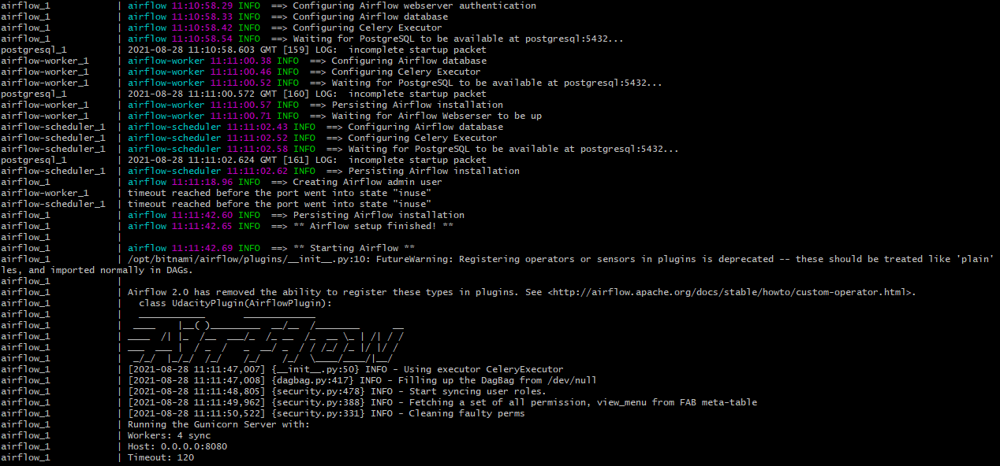
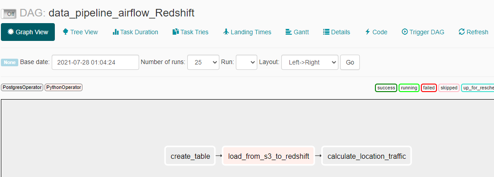
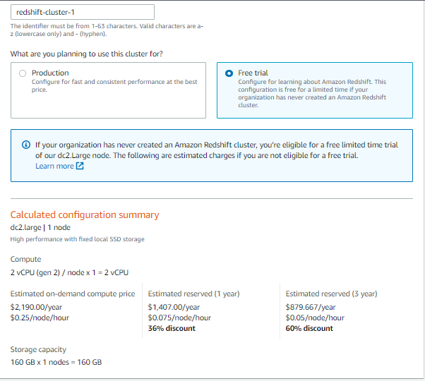
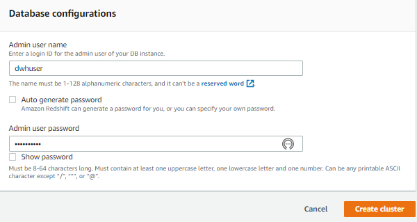
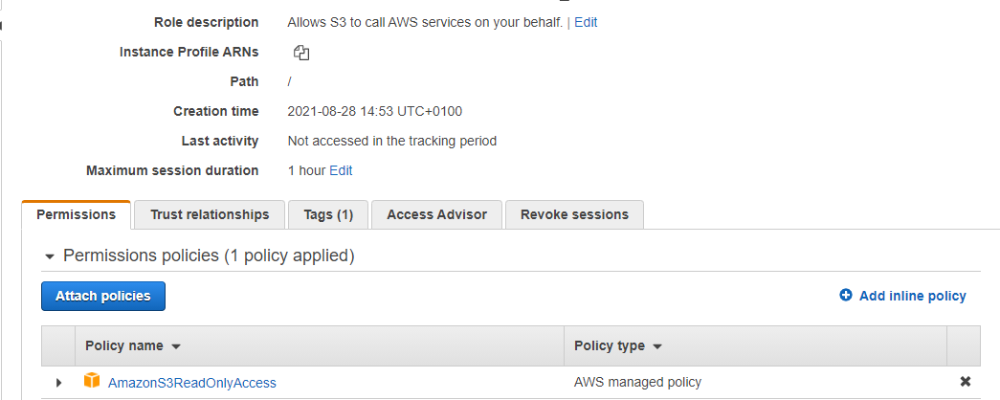
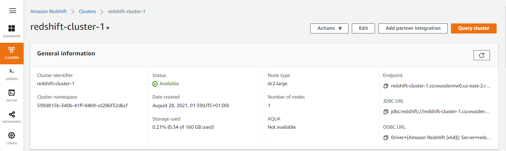
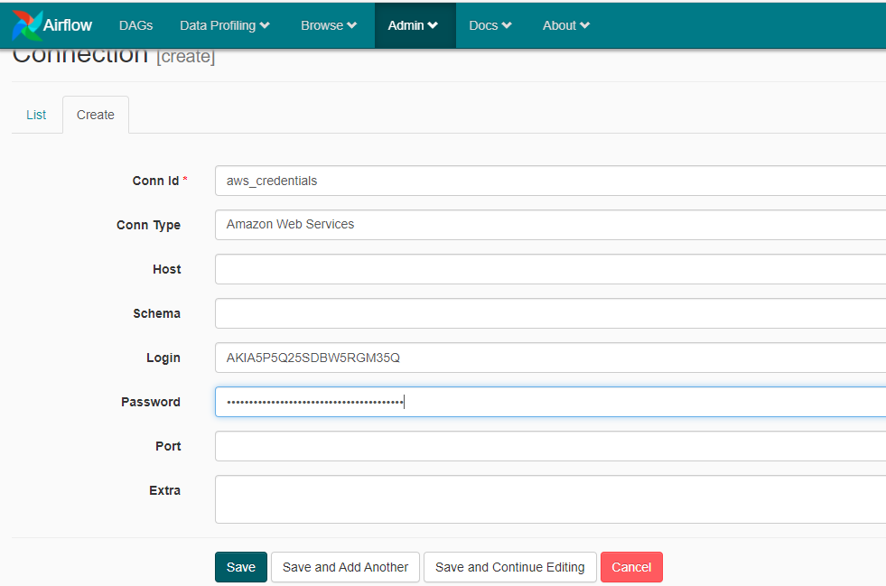
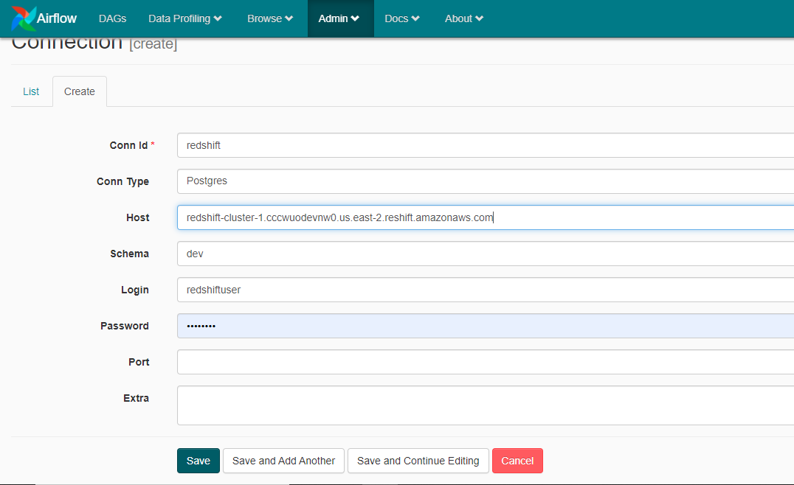

# DataPipeLine-S3-to-Redshift-Using-Airflow

# Overview

In this project, we will load divvy trips dataset present in S3 to AWS redshift with the help of Airflow. Divvy is Chicago's bike share system that provides a fast and convenient way to get around without having your own bike.

At first we need to finish below tasks

- Build Airflow and Postgres image on docker windows using docker-compose.
- Create Redshift cluster using AWS console.
- upload divvy trips dataset files [Link to files](https://divvy-tripdata.s3.amazonaws.com/index.html)(pick any year) to S3 bucket. my bucket location is s3://udacity-dend/data-pipelines

## Step 1

### Build Airflow image using docker-compose up command

  
  
### Open Airflow GUI, you will see something like this about datapipeline.

  
  
## Step 2

### Create AWS Redshift cluster using AWS console.
  

  
  
 

  
   
 ### Cluster Details. 
 
 

  
 
 ### Add cluster permission to read S3 buckets. I have created redshifts3 role as shown below.
   
 

  
   
  

  
    
 ### final cluster details 
    
 

  
   
## Step 3

### Add AWS and Redshift credentials in Airflow. In aws_credentials, login is your Iam user access key id and password is secret access key.
    
 

  

### Host is cluster end-point
   
 

  
 
## Step 4

Switch on the dags in Airflow and verify tables are created in AWS redshift or not.

  
  
As you see our divvy trips tables are created in redshift as per sql_statements file which is present in /dags/modules folder
  
## Step 5 
  
### Verfiy the data loaded in redshift tables.
  

  

